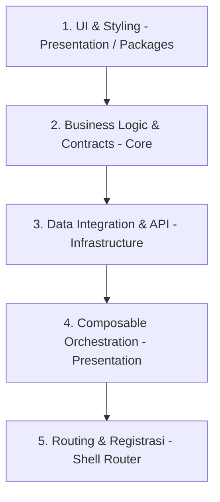

# Code Standardization: Neurovi V2

Dokumen ini mendefinisikan standar koding dan arsitektur untuk pengembangan Neurovi V2 dalam lingkungan monorepo. Semua developer wajib mengikuti standar ini untuk menjaga konsistensi, keamanan tipe, dan performa aplikasi.

---

## 1. Naming Conventions

Pemberian nama harus deskriptif dan konsisten mengikuti pola berikut:

### **Filenames & Folders**

- **Vue Components**: `UpperCamelCase.vue` (contoh: `FormInput.vue`, `UnitList.vue`).
- **Logic & Services**: `kebab-case.ts` (contoh: `auth-service.ts`, `api-client.ts`).
- **Suffix-based Naming**: Menggunakan suffix untuk memperjelas identitas layer:
  - `*.usecase.ts`: Logika bisnis/domain (Core).
  - `*.model.ts` & `*.input.ts`: Domain models dan input types (Core).
  - `*.repository.ts`: Interface (Core) atau Implementasi (Infrastructure).
  - `*.mapper.ts` & `*.provider.ts`: Transformasi data dan external providers (Infrastructure).
  - `*.schema.ts` & `*.validator.ts`: Validasi data dan schema zod (Infrastructure).
  - `*.routes.ts`: Definisi rute per module (Shell Apps -> `src/router/`).
  - `*.middleware.ts`: Logika navigation guard (Shell Apps -> `src/middleware/`).
- **Tenant Folders**: Selalu diawali dengan underscore: `_tenants/{tenant-code}/`.

### **Variable & Code Styling**

- **Types/Interfaces**: `PascalCase` (contoh: `interface UnitForm {}`).
- **Constants**: `SCREAMING_SNAKE_CASE` (contoh: `const UNIT_OPTIONS`).
- **Variables**: `camelCase` (contoh: `let unitData`).
- **Boolean Variables**: `camelCase` dengan prefix **is** / **has** (contoh: `isLoading`, `hasDiagnose`).
- **Functions**: `camelCase` (contoh: `function fetchData() {}` atau `const handleLogin = () => {}`).

---

## 2. Folder Structure (Tenanted Monorepo)

Struktur folder mengikuti pola **Shared Base + Tenant Overrides** untuk skalabilitas maksimal.

```bash
├── apps/                  # Shell Applications (Vue 3 + Vite)
│   └── simrs/             # Client Shell Utama
│       └── src/
│           ├── router/    # Routing Orchestration (index.ts + *.routes.ts)
│           └── middleware/ # Navigation Guards (Auth, RBAC, etc)
├── modules/               # Domain Modules (Clean Architecture)
│   ├── core/              # Layer 1: Business Logic, Models & Interfaces
│   ├── infrastructure/    # Layer 2: Repositories Implementation & Mappers
│   └── presentation/      # Layer 3: UI Components, Composables & Pages
│       └── src/
│           ├── base/      # Generic Product (Read-Only untuk Custom)
│           └── _tenants/  # Overrides & Extension per Client
└── packages/              # Shared Utilities & UI Library (Design System)
```

---

## 3. Separation of Concerns (Layered Architecture)

Kita membagi tanggung jawab kode ke dalam 3 layer utama untuk memastikan kode mudah di-test dan tidak saling ketergantungan secara acak.

| Layer              | Lokasi                   | Tanggung Jawab                                                     | Aturan Ketat                                                               |
| :----------------- | :----------------------- | :----------------------------------------------------------------- | :------------------------------------------------------------------------- |
| **Core**           | `modules/core`           | Domain model, Interfaces, & Business Use-cases.                    | **Zero Dependency**: Tidak boleh meng-import dari Infra atau Presentation. |
| **Infrastructure** | `modules/infrastructure` | Implementasi Repository, Axios calls, Web Storage, & Data Mappers. | Mengimplementasikan Interface yang didefinisikan di Core.                  |
| **Presentation**   | `modules/presentation`   | Vue Components, Composables, UI Logic                              | **Consumer**: Menggunakan Usecase dari Core untuk memproses data.          |

---

---

## 4. Development Flow

Pengembangan fitur baru atau modifikasi fitur yang sudah ada wajib mengikuti alur terstandarisasi berbasis Clean Architecture berikut ini:

### **Alur Kerja Pengembang (Step-by-Step)**



#### **Step 1: UI & Styling (Presentation / Packages Layer)**

- **Shared/Generic UI Components**: Komponen atom/desain sistem yang bisa dipakai lintas modul ditaruh di `packages/ui/src/components/ui/[nama-komponen]/` menggunakan struktur wajib 4-file (`.vue`, `.variants.ts` pakai CVA, `index.ts` barrel, dan `.stories.ts`).
- **Page-Specific Components**: Komponen pembangun halaman yang hanya dipakai spesifik di satu modul ditaruh di `modules/presentation/src/[modul]/base/components/`.
- **Halaman (Pages)**: Layout utuh halaman ditaruh di `modules/presentation/src/[modul]/base/pages/`.
- _Aturan Ketat_: Tidak boleh ada logika API, pemanggilan Axios, atau manipulasi state backend langsung di dalam file `.vue`.

#### **Step 2: Business Logic & Contracts (Core Layer)**

- **Folder**: `modules/core/src/[modul]/base/`
- **Komponen & File**:
  - `*.model.ts`: Entity/data domain (interface data bersih).
  - `*.input.ts`: DTO / Input type untuk form/payload API.
  - `*.repository.ts`: Kontrak/Interface (abstraksi data fetching).
  - `*.usecase.ts`: Logika bisnis/alur kerja utama (class independen).
- _Aturan Ketat_: **Zero Dependency!** Layer ini murni TypeScript, dilarang meng-import Axios, Vue, UI Library, atau layer luar lainnya.

#### **Step 3: Data Integration & API (Infrastructure Layer)**

- **Folder**: `modules/infrastructure/src/[modul]/base/`
- **Komponen & File**:
  - `*.provider.ts`: Inisialisasi HTTP client (Axios/SDK) dan tempat melakukan instansiasi UseCase dari Core agar siap dikonsumsi UI.
  - `*.repository.ts`: Implementasi konkret dari repository di Core (melakukan network call API sebenarnya).
  - `*.mapper.ts`: Pemetaan (mapping) data response kotor dari API menjadi data bersih ter-type sesuai `*.model.ts` milik Core.
  - `*.schema.ts` / `*.validator.ts`: Schema validasi input form menggunakan **Zod**.

#### **Step 4: Composable Orchestration (Presentation Layer)**

- **Folder**: `modules/presentation/src/[modul]/base/composables/`
- **Komponen & File**: `use[Feature].ts` (Custom Composable).
- **Tanggung Jawab**:
  - **Vee-Validate**: Mengelola state form, binding field, dan validasi menggunakan **Zod Schema** yang didefinisikan di Infrastructure.
  - **TanStack Query / Direct UseCase**: Memanggil UseCase instance dari Infrastructure untuk memicu data mutation atau query data.
  - Mengekspos variabel reaktif (state form, error, loading, submit handler) ke component `.vue`.

#### **Step 5: Routing & Registrasi (Shell Applications)**

- **Folder**: `apps/simrs/src/router/` atau router orchestration modul terkait.
- **Tugas**: Mendaftarkan file halaman `Page` yang ada di Presentation agar browser punya alamat URL-nya.

---

### **Form & Validation Standards**

- **vee-validate**: Digunakan untuk form state management dan binding UI.
- **zod**: Sebagai single source of truth untuk schema validation.

**Pattern:**

- **Schema-driven form**: Definisi validasi dipusatkan dalam satu schema zod.
- **Centralized validation**: Menghindari penulisan rules yang tersebar di template, sehingga logic validasi mudah di-reuse dan di-test.

---

### **Data Fetching Standards**

- **@tanstack/query**
  - Menangani caching, request deduplication, dan server-state management.
  - Memastikan data sinkron di seluruh komponen tanpa perlu prop-drilling yang dalam.

- **axios**
  - Sebagai transport layer (HTTP client).
  - Centralized config: Interceptor untuk token auth, logging, dan global error handling berada di sini.

**Separation of Concerns:**

- **Axios**: Bertanggung jawab atas "bagaimana data dikirim" (transport layer).
- **Tanstack Query**: Bertanggung jawab atas "bagaimana data dikelola di UI" (orchestration & state layer).

---

## 5. Reusability Principles

Prinsip utama kita adalah **DRY (Don't Repeat Yourself)** di level Base, namun **Safe-Overriding** di level Tenant.

### **Base vs Extension**

- **Sacret Base**: Folder `base/` berisi logika yang 80-90% sama di semua RS. Jika ada perubahan yang bersifat umum, perbaiki di sini.

---

## 6. Deployment & Versioning Standards

- **Hybrid Versioning**: Versi aplikasi adalah gabungan dari `Base Semver` + `Tenant Revision`.
  - Format: `v[Major.Minor.Patch]+[TenantCode].rev-[GitCount]`

---

## 8. Error Handling

Kita menggunakan **AppError** sebagai standar komunikasi error antar layer. Penjelasan lengkap mengenai hierarchy error, mapping, dan handling dapat dilihat di:
👉 **[Error Handling Standard](file:///Users/dystopia/tamtech/modular-simrs-vue/docs/error-handling.md)**

---

## 9. Key Principles

- **Consistency over Preference**: Kita lebih mengutamakan konsistensi pola di seluruh project daripada preferensi gaya koding pribadi.
- **Centralized Logic**: Logika krusial seperti Schema Validation, Fetching mechanism, dan Global Config harus dipusatkan di satu tempat (`core` atau `packages`) untuk kemudahan maintenance.
- **Separation of Concerns**: Pemisahan yang tegas antara **UI (Presentation)**, **Logic (Core)**, dan **Data (Infrastructure)**. Tidak boleh ada logika API di dalam file `.vue`.
